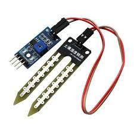
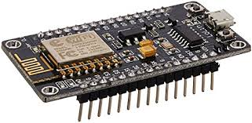
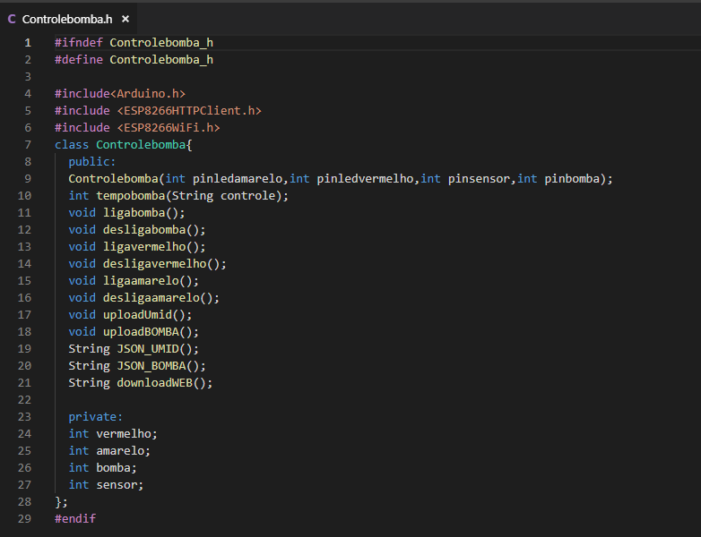
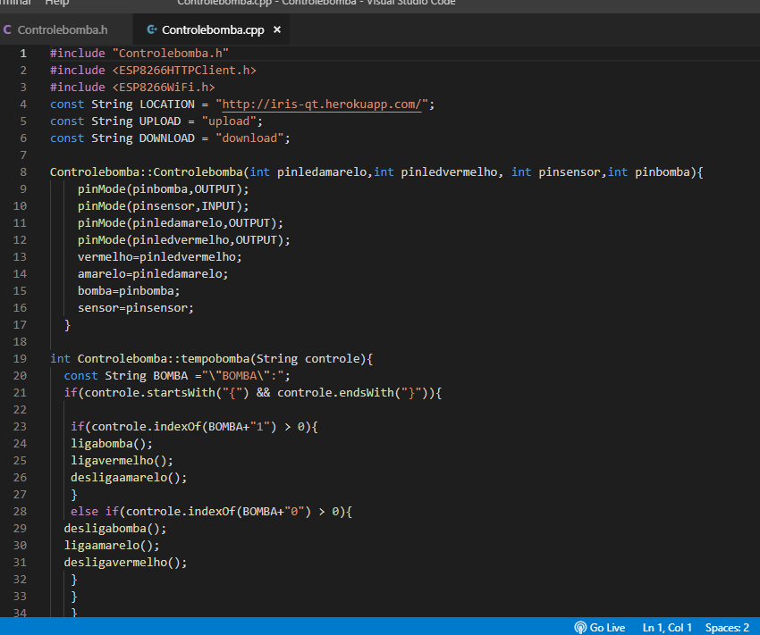
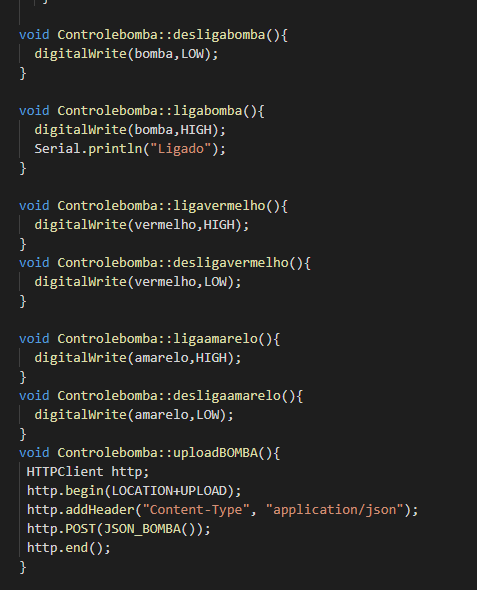
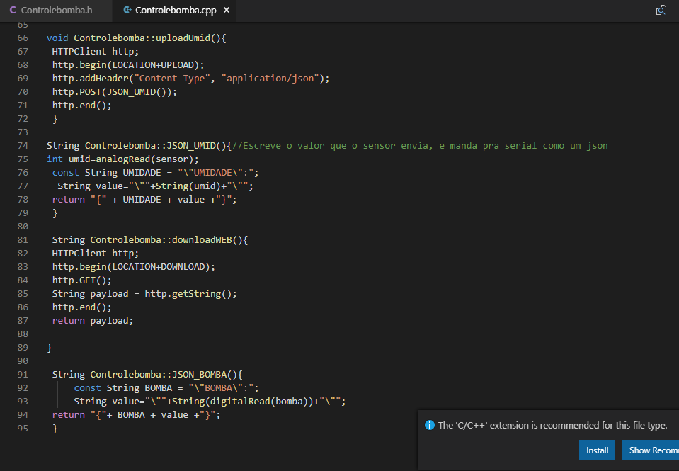
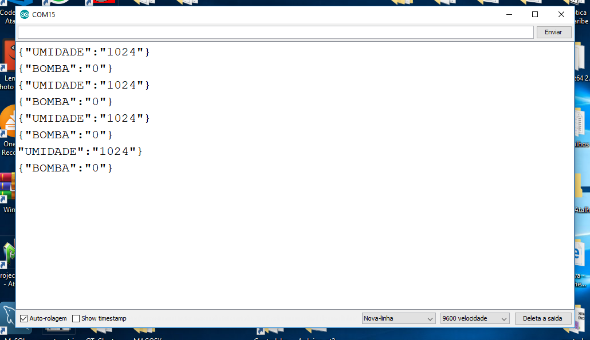
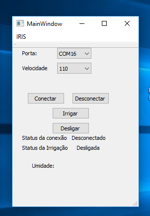
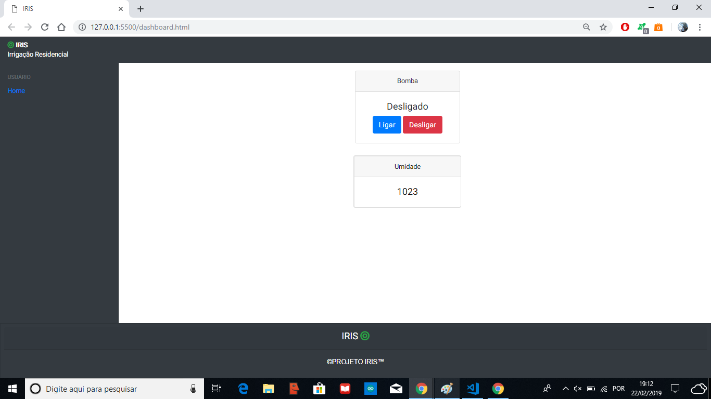

# IRIS - QT

## Objetivo

Criar uma interface local e um Interface Web onde o usúario possa ter controle da sua irrigação, e possa monitorar a umidade da planta.

## Materiais:

* Esp 8266
* Bomba de água 

* Transistor
* Jumpers
* Sensor de Umidade

## ESP 8266

A esp8266 mostrada abaixo, foi usa para coletar e enviar os dados do sensor de umidade, controlar a bomba e os leds, lendo valoroes do Serial para determinar qual ação irá realizar. No caso, se for mandado o comando {"BOMBA":0}, a bomba será ligada, e se for {"BOMBA":1},
a bomba será desligada.

 

## Esquemático

Como a ESP não suporta a corrente que a bomba necessita, deve ser conectado uma fonte externa para alimentar a fonte. Está alimentação será controlada pelo transistor, funcionando semelhante a uma chave de controle, ao receber o sinal da ESP, conectará o GND da ESP e da Bomba, ligando-a.
O transistor foi ligado ao Pino 5 da ESP, e os leds indicativos do estado da bomba, sendo vermelho para ligado e amarelo para desligado, foram ligados aos Pinos 6 e 7, o sensor por sua vez foi ligado ao pino A0 da ESP, pois este efetua leituras analógicas.

## Biblioteca

 A biblioteca Controlebomba.h, foi criada de forma a ler os dados enviador pelo sensor e pela bomba, e transformá-los em Json, bem como para atualizar e receber os dados da Interface WEB, recebendo os pinos nas quais os componentes estão ligados. Por sua vez, a biblioteca necessita de outras duas outras bibliotecas nativas da ESP, a biblioteca *wifi.h* e *HHTPClient.h*, para conseguir realizar a conexão via wifi e http com a interface WEB.
 
 
 
 
 
 
 
 

## Monitor Serial

No monitor Serial, são mostrados os valores de umidade lidos, bem como o estado da bomba, sendo 1 o estado ativado, e 0 o estado desativado. Os valores são impressos em formato de Json, para facilitar a comunicação entre as interfaces, e garantir a integridade dos dados.

## Aplicação do QTCreator

No QTCreator, foi criada uma aplicação para a informar ao usuário a umidade da planta, bem como dar a ele controle de forma local a sua aplicação, fazendo possível que ele ative a bomba a qualquer momento. Através dos botôes ligar e desligar, o usuário tem total controle, sobre o sistema, emitindo os dados de controle na serial, para que a Esp interprete os comandos. A porta serial que estiver disponível, será mostrada automaticamente, e a velocidade deve ser configura de acordo com a placa utilizada, no caso da ESP 8266, será o baudrate de 115200.OBS: Por utilizarem a mesma porta Serial, o Monitor Serial e a Aplicação QT não podem estar abertas aos mesmo tempo. Ao se apertar ligar, a Aplicação enviará a  Porta Serial o comamdo  {"BOMBA":1}, e ao se apertar desligar, enviará {"BOMBA":0}. Em umidade, o sa´rio pode visualizar o valor da umidade.

## Interface WEB

A interface WEB permite que o usário possa ter controle mesmo a distância, através da internet. Os botôes ligar e desligar emitem comandos para acionar e desativar a bomba, da mesma forma que a aplicação do QTCreator, enquanto o estado da bomba é mostrado logo acima.
A umidade por sua vez, é mostrada logo abaixo, ainda em valores que o sensor de Umidade lê.

